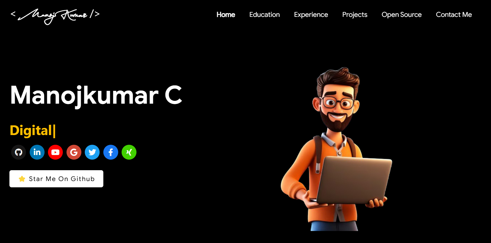
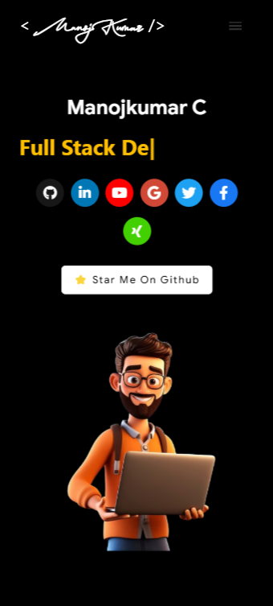

# 🚀 Personal Portfolio  
🎨 **A modern and responsive personal portfolio website** built with **React.js, Jest, and more!**  

## 🔗 Live Demo  
[]([YOUR_WEBSITE_LINK_HERE](https://manojkumar-c.vercel.app/))  

---

## 📌 Features
- ✅ **Fully Responsive** – Works on all devices  
- ✅ **Modern UI/UX** – Clean and minimalistic design  
- ✅ **Dark & Light Mode** – (If applicable)  
- ✅ **Optimized Performance** – Lazy loading & optimized assets  
- ✅ **Jest Testing** – Ensuring component reliability  
- ✅ **SEO Friendly** – Meta tags, structured data  
- ✅ **Social Media Links** – Showcase your profiles  

---

## ⚙️ Tech Stack
- **Frontend:** React.js, Tailwind CSS / Styled Components  
- **Testing:** Jest, React Testing Library  
- **Deployment:** Vercel / Netlify / Firebase Hosting  
- **State Management:** Redux / Context API (if used)  

---

## 📸 Screenshots
| 💻 Desktop | 📱 Mobile |
|-----------|----------|
|  |  |

---

## 🛠 Installation & Setup
1️⃣ **Clone the repository**  
```bash
git clone https://github.com/YOUR_GITHUB_USERNAME/YOUR_REPO_NAME.git
